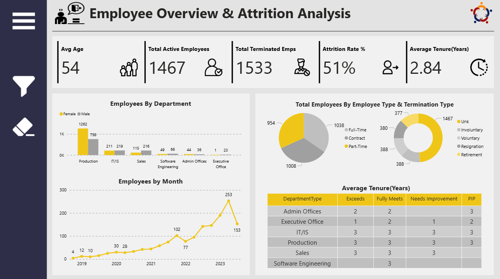
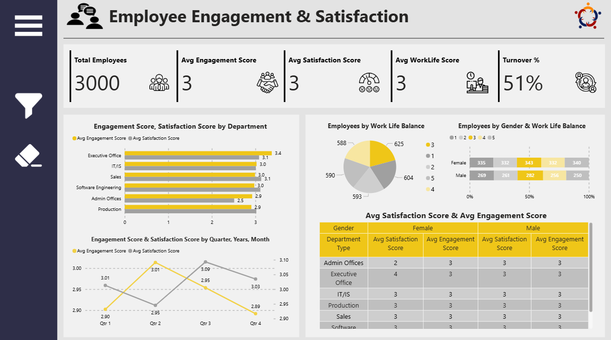
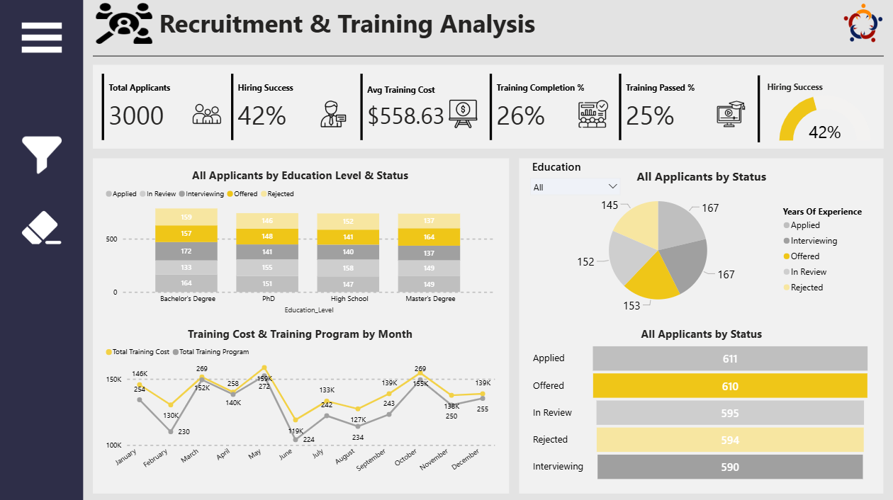
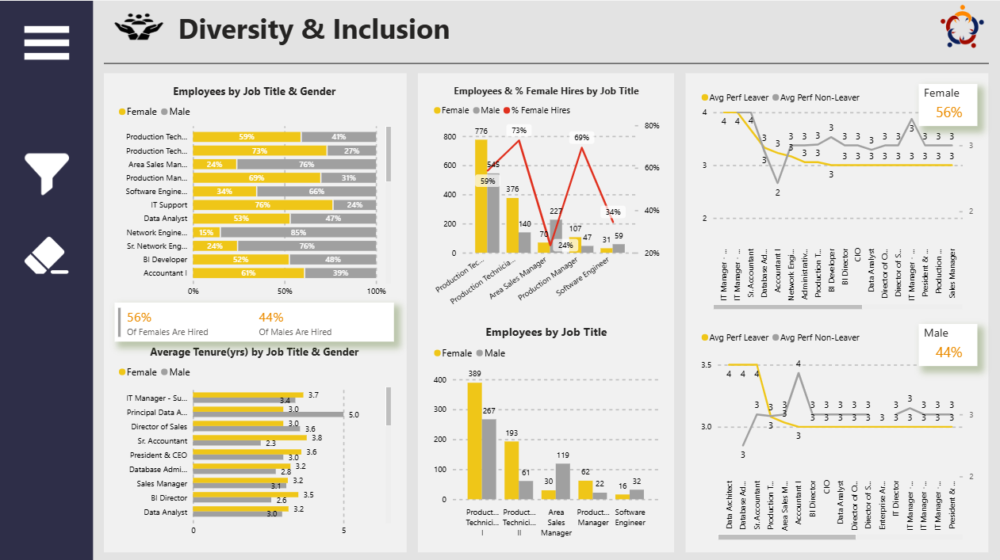

# Power BI Human Resources (HR) Analytics Dashboard 

## 📊 Project Overview  
This repository showcases a Power BI Dashboard Project designed to provide comprehensive insights into an organization's human resources data. The report covers key HR functions, including employee demographics, recruitment, engagement, and diversity.
The PBIX file is not shared publicly to protect the dataset, but the screenshots below demonstrate the dashboard's design and analytical capabilities.

---

## 🖼️ Dashboard Snapshots  

### Dashboard 1 – Employee Overview & Attrition Analysis
  

### Dashboard 2 – Employee Engagement & Satisfaction  
  

### Dashboard 3 – Recruitment & Training Analysis

### Dashboard 4 – Diversity & Inclusion  

---

## ⚙️ Key Features  
- Employee Metrics: Track key HR metrics like average age, attrition rate, and employee tenure.
- Recruitment & Training Pipeline: Analyze total applicants, hiring success, training costs, and completion rates.
- Engagement & Satisfaction: Monitor employee sentiment with scores for engagement, satisfaction, and work-life balance.
- Diversity & Inclusion: Visualize workforce composition by gender, job title, and performance.
- Trend Analysis: Identify trends over time for employee growth, engagement scores, and training programs.
- Departmental Breakdown: Slice data to analyze metrics by department and other demographic factors.
- Interactive Visuals: Utilize charts and tables for a clear and dynamic view of the data.

---

## 🚀 Tech Stack  
- **Tool:** Power BI  
- **Data Source:** SSMS (dummy dataset for practice)  
- **Language:** DAX for custom calculations and measures  

---

## 📬 Contact  
👤 **Aryan Dharmesh Patel**  
- 💼 Power BI Developer | Full Stack Developer  
- 🔗 [LinkedIn](www.linkedin.com/in/aryan-patel-ap02)
- 🔗 [Portfolio](https://www.datascienceportfol.io/aryan_dharmesh_patel)
- 📧 aryanpatelaryan81@gmail.com 

